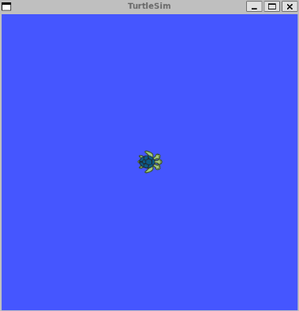
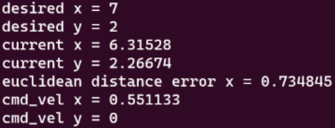
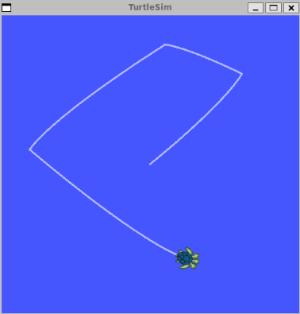

# Proportional Robot Controller with ROS

# About the project

This project seeks to move the [turtlesim](http://wiki.ros.org/turtlesim) robot to a desired destination defined by `x` and `y` cordinates. The objective of the proportional ($K_p$) controller is to minimize the error between the current robot position and the desired position. This is achieved by retrieving the euclidean distance error and the angular error and publishing commands to move the robot such that these errors are minimised.

In order to move to the desired location, the turtlesim will first turn in the direction of the desired destination (minimizing the angular error) and then move towards that point (minimizing the euclidean distance error).

Internally, the robot controller publishes the robot command velocity at a frequency of 10 $Hz$ and subscribes to another topic to get the robot pose.

## Built with:
 - ROS Noetic
 - CMake
 - Catkin
 - C++

# Getting Started

## Prerequisites  

Install ROS Noetic from [http://wiki.ros.org/noetic/Installation](http://wiki.ros.org/noetic/Installation)

## Installation
1. Create a catkin workspace

2. Clone the repo into `<catkin workspace>/src` with:
```
git clone https://github.com/denis-mutuma/proportional-robot-controller.git
```

3. Run `catkin_make` in the catkin workspace to build the project

4. Install tutlesim by running `sudo apt-get install ros-$(rosversion -d)-turtlesim`

# Usage

1. In a new terminal run `roscore` to start ros master

2. In a new terminal run turtlesim using: `rosrun turtlesim turtlesim_node` and a new window similar to the one below will be opened:



3. In a new terminal run `rosrun practical goto_xy` to run the proportional robot contoller and you'll be prompted to provide the x and y cordinates via the terminal. Enter values for x and why between 0 and 11. You should see the turtle turning (if need be) and moving to the desired location with an output similar to this:



4. The turtle will move to  the desired position and repeating this multiple times will produce something similar the image below:



# Contributing

1. Fork the Project

2. Create your Feature Branch (git checkout -b feature/AmazingFeature)

3. Commit your Changes (git commit -m 'Add some AmazingFeature')

4. Push to the Branch (git push origin feature/AmazingFeature)

5. Open a Pull Request

# License

Distributed under the **BSD** License.
